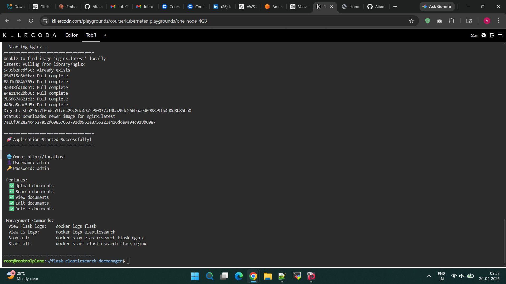
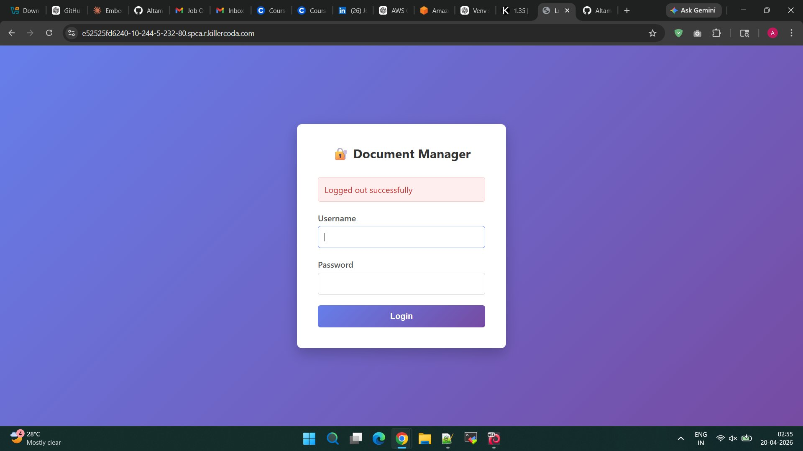
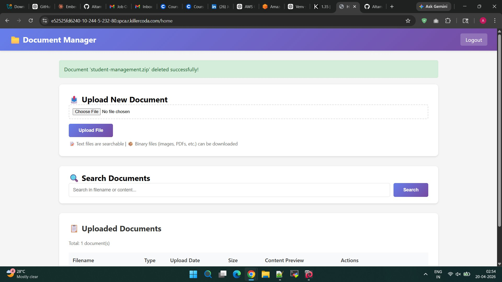
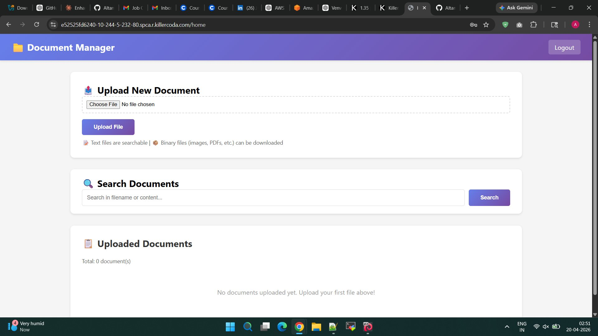

# 📄 Flask Elasticsearch Document Manager

> A full-featured, containerised document management system built with Flask, Elasticsearch, and Nginx — supporting upload, search, view, edit, download, and delete for any file type.

    

---

## 🖼 Live Demo — Proof of Deployment

> Screenshots taken from a live running instance on **20-04-2026**.

### 🚀 Application Startup (KillerCoda Terminal)



### 🔐 Login Page



### 🏠 Dashboard — Home Page


### 📤 Upload & Search Interface


### 🗑 Delete Operation Success



### 📋 Uploaded Documents Panel



---

## 🏗 Architecture

```
Client (Browser)
      │  HTTP :80
      ▼
  ┌─────────┐
  │  Nginx  │  Reverse Proxy · 10MB upload limit
  └────┬────┘
       │  Proxy → :5000
       ▼
  ┌──────────────┐
  │  Flask App   │  Gunicorn · 2 workers · Session Auth
  │  (Python)    │  CRUD Routes + REST API
  └──────┬───────┘
         │  HTTP REST → :9200
         ▼
  ┌─────────────────┐
  │  Elasticsearch  │  Single Node · Index: uploads
  │    8.11.0       │  Full-text + Binary storage
  └─────────────────┘

All containers share Docker bridge network: flasknet
```

---

## ✨ Features

| Feature | Description |
|---|---|
| 🔐 Authentication | Session-based login (admin/admin) |
| 📤 File Upload | Any file type — text or binary |
| 🔍 Full-text Search | Multi-match across filename + content |
| 👁 View Document | In-browser document preview |
| ✏ Edit Document | Inline editing for text files |
| ⬇ Download | Original file download with correct MIME type |
| 🗑 Delete | Permanent document removal |
| 📊 Stats API | `GET /api/stats` — document count |
| 🧠 MIME Detection | Automatic text vs binary classification |

---

## 🚀 Quick Start

```bash
# Make the setup script executable and run it
chmod +x flask-elastic.sh
./flask-elastic.sh
```

Access the application at **http://localhost**

| Field | Value |
|---|---|
| URL | http://localhost |
| Username | `admin` |
| Password | `admin` |

---

## 📁 Project Structure

```
flask-elastic-app/
├── app/
│   ├── app.py                  # Flask application (routes, ES logic)
│   ├── requirements.txt        # Python dependencies
│   └── templates/
│       ├── login.html          # Login page
│       ├── home.html           # Dashboard (upload + search + list)
│       ├── view.html           # Document viewer
│       └── edit.html           # Document editor
├── nginx/
│   └── default.conf            # Nginx reverse proxy config
├── Dockerfile                  # Flask container build
├── screenshots/                # Proof of deployment screenshots
│   ├── startup-terminal.png
│   ├── login-page.png
│   ├── dashboard-home.png
│   ├── upload-search.png
│   ├── delete-success.png
│   └── documents-panel.png
├── .gitignore
└── README.md
```

---

## 🗄 Elasticsearch Index Schema

**Index name:** `uploads`

| Field | Type | Notes |
|---|---|---|
| `filename` | `text` | Searchable filename |
| `content` | `text` | Searchable text content |
| `content_base64` | `text` (not indexed) | Binary files encoded as Base64 |
| `upload_date` | `date` | ISO 8601 UTC timestamp |
| `file_size` | `integer` | Size in bytes |
| `mime_type` | `keyword` | e.g. `text/plain`, `application/pdf` |
| `is_binary` | `boolean` | `true` for binary, `false` for text |

Document IDs are UUID v4.

---

## 📂 Supported File Types

### Text Files (Searchable & Editable)
`.txt` `.log` `.json` `.xml` `.csv` `.md` `.py` `.js` `.html` `.css` `.java` `.cpp` `.sh` `.yml` `.yaml` `.ini` `.conf` `.sql` `.php` `.rb` `.go` `.rs` `.swift` `.kt`

### Binary Files (Upload & Download)
`.pdf` `.docx` `.xlsx` `.pptx` `.jpg` `.png` `.gif` `.zip` `.tar.gz` `.mp3` `.mp4` and any other file type.

---

## 🔌 API Endpoints

| Method | Endpoint | Auth | Description |
|---|---|---|---|
| `GET/POST` | `/` | No | Login page |
| `GET/POST` | `/home` | Session | Dashboard, upload, search |
| `GET` | `/view/<doc_id>` | Session | View document details |
| `GET/POST` | `/edit/<doc_id>` | Session | Edit text document |
| `GET` | `/download/<doc_id>` | Session | Download original file |
| `POST` | `/delete/<doc_id>` | Session | Delete document |
| `GET` | `/api/stats` | Session | JSON stats |
| `GET` | `/logout` | Session | Invalidate session |

---

## 🐳 Docker Container Management

```bash
# View logs
docker logs flask
docker logs elasticsearch
docker logs nginx

# Stop all containers
docker stop elasticsearch flask nginx

# Start all containers
docker start elasticsearch flask nginx

# Remove everything and clean up
docker rm -f elasticsearch flask nginx
docker network rm flasknet
docker rmi flask-app
```

---

## ⚙ Configuration

| Parameter | Location | Default |
|---|---|---|
| Max upload size | `nginx/default.conf` → `client_max_body_size` | `10M` |
| ES heap size | Docker run env `ES_JAVA_OPTS` | `-Xms512m -Xmx512m` |
| ES connect retries | `app.py` → `max_retries` | `30` |
| Gunicorn workers | `Dockerfile` CMD | `2` |
| Flask secret key | `app.py` → `app.secret_key` | `supersecretkey` |

> ⚠ **Security Note:** Change `app.secret_key` and credentials before any production deployment.

---

## 🔧 Tech Stack

- **Flask** — Python web framework
- **Gunicorn** — Production WSGI server
- **Elasticsearch 8.11.0** — Document store and full-text search engine
- **Nginx** — Reverse proxy with upload size enforcement
- **Docker** — Containerisation (no docker-compose; raw `docker run` commands)
- **Python 3.10-slim** — Minimal base image

---

## 🐛 Known Limitations & Improvement Suggestions

- Credentials are hardcoded (`admin/admin`) — should use environment variables or a secrets manager
- `app.secret_key` is hardcoded — rotate and externalise
- No pagination on document listing (capped at 100 results)
- Binary files stored as Base64 in Elasticsearch — inefficient for large files; consider object storage (S3/MinIO)
- No HTTPS — Nginx should be configured with TLS for production
- Single-user only — no role-based access control

---

## 📝 Branch Name Suggestion

```
feature/flask-elasticsearch-docmanager
```

> Alternatively: `feat/docmanager-elastic-backend` · `dev/flask-es-crud-app`
